# PokeAPI Challenge - Architecture Diagrams & Flowcharts

---

## C4 Model - System Context (Level 1)

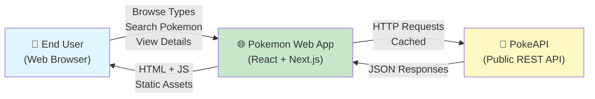

**Key Elements:**
- **User:** Web browser (desktop/mobile)
- **App:** Next.js server-rendered application
- **PokeAPI:** External read-only REST API

---

## C4 Model - Container Diagram (Level 2)

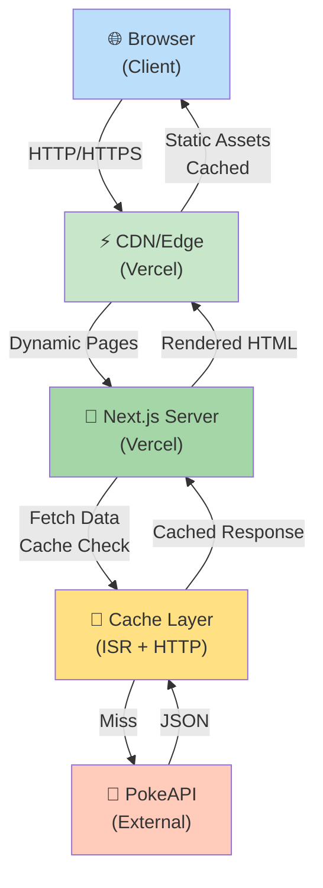

**Containers:**
1. **CDN (Vercel Edge)** - Static asset serving + edge caching
2. **Next.js Server** - Dynamic page rendering + API orchestration
3. **Cache Layer** - Request deduplication + ISR management
4. **PokeAPI** - External read-only data source

---

## Component Architecture (Level 3)

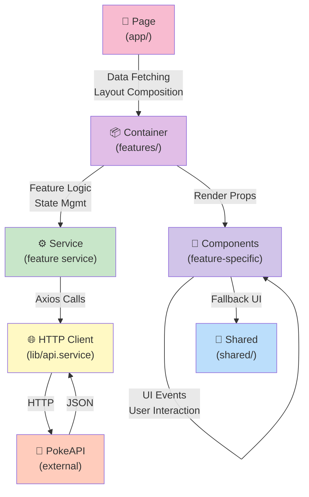

---

## Data Flow - Types Browser Page

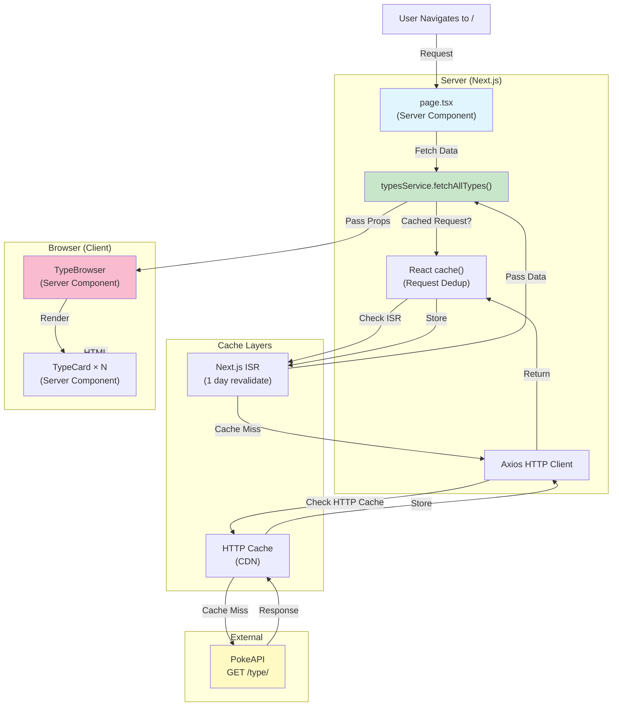

---

## Data Flow - Pokémon List with Search & Pagination

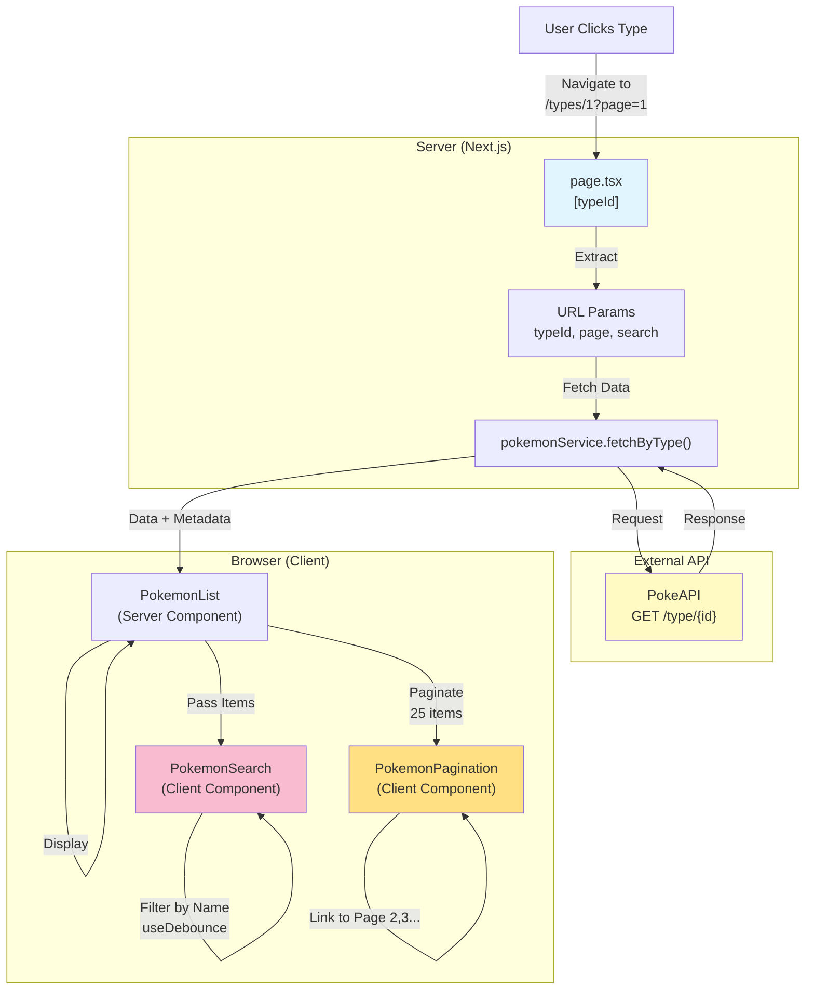

---

## Data Flow - Pokémon Detail Page

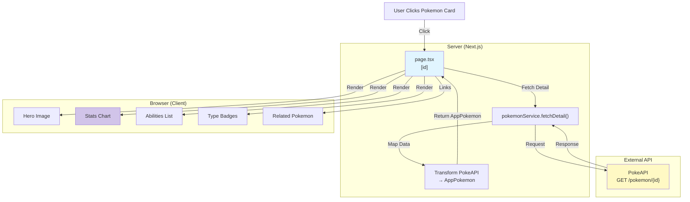

---

## Feature Module Structure

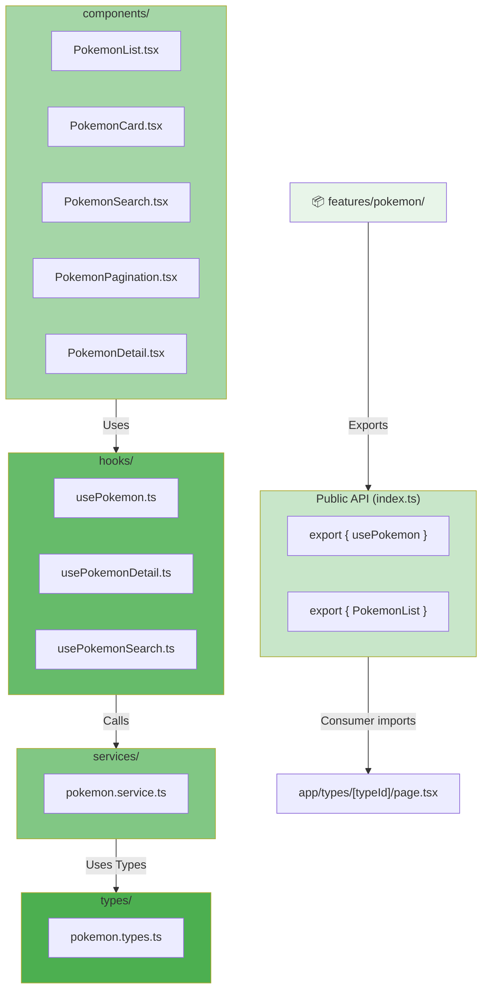

---

## Client-Side Search Architecture

```mermaid
graph LR
    Input["SearchInput<br/>(controlled input)"]
    Debounce["useDebounce<br/>(300ms)"]
    Filter["Filter Items<br/>(client-side)"]
    Display["PokemonList<br/>(re-render)"]
    
    Input -->|onChange: setQuery| Debounce
    Debounce -->|Debounced value| Filter
    Filter -->|items.filter(name)| Filter
    Filter -->|filtered items| Display
    Display -->|User sees results| Display
    
    Note["⚡ Instant results<br/>No API calls<br/>No loading state"]
    
    style Input fill:#f8bbd0
    style Debounce fill:#e1bee7
    style Filter fill:#d1c4e9
    style Display fill:#bbdefb
    style Note fill:#ffe082
```

---

## Caching Layers (Multi-tiered)

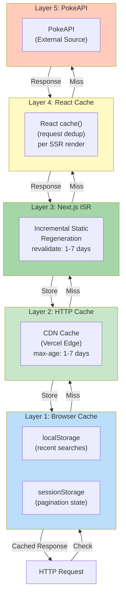

---

## Error Handling Strategy

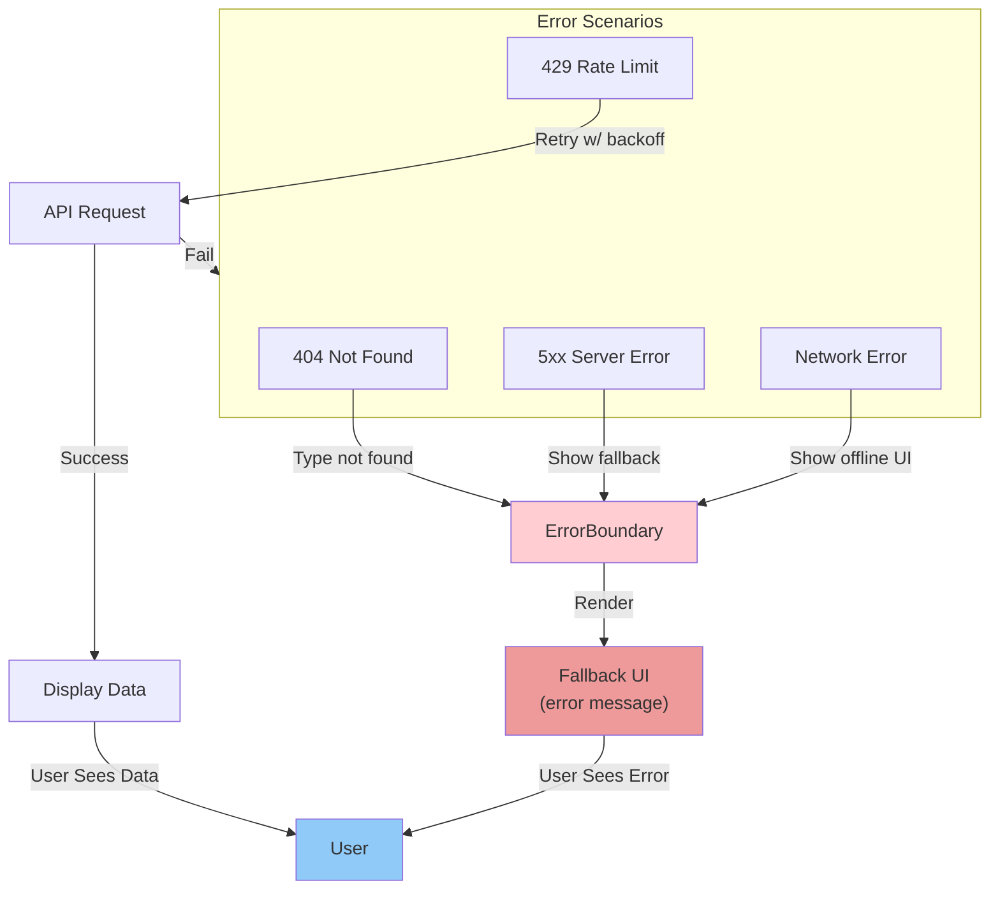

---

## Page Structure & Routing

```
/
├── / (Home / Types Browser)
│   ├── TypeBrowser
│   └── TypeGrid
│       └── TypeCard[] (clickable)
│
├── /types/[typeId] (Pokémon List)
│   ├── URL params: page, search
│   ├── PokemonList
│   │   └── PokemonCard[]
│   ├── PokemonSearch (client)
│   └── PokemonPagination (client)
│
├── /pokemon/[id] (Detail)
│   ├── Hero Image
│   ├── StatsChart
│   ├── AbilitiesList
│   ├── TypeBadges
│   └── RelatedPokemon[]
│
└── /error (Error Page)
    └── Error Message + Retry
```

---

## Performance Optimization Plan

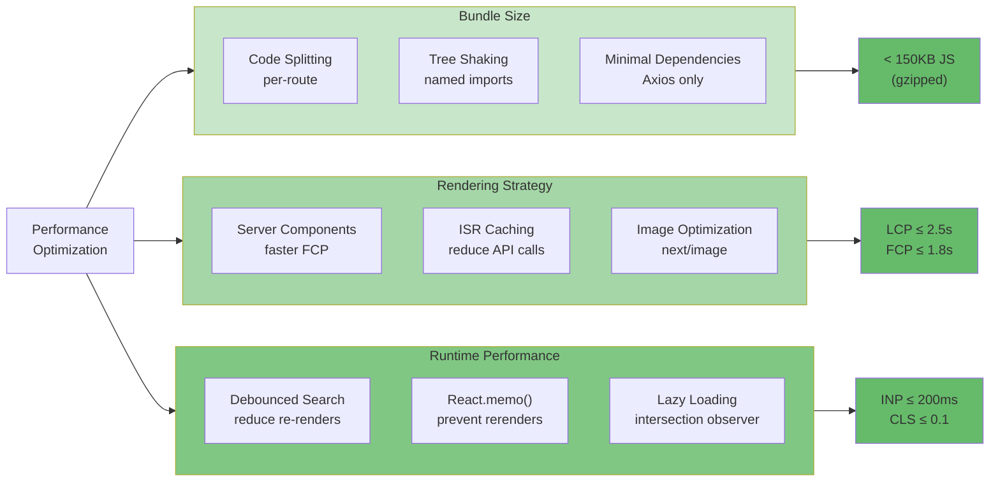

---

## Deployment Architecture

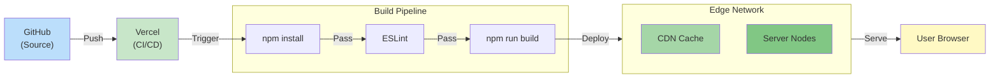

---

## TypeScript Type Hierarchy

```
PokeAPI Schema (External)
├── PokeAPIType
├── PokeAPIPokemon
├── PokeAPIPokemonDetail
└── PokeAPIResponse<T>

App Domain Model (Internal)
├── AppType
├── AppPokemon
├── AppPokemonDetail
└── PaginatedResponse<T>

Data Transformation Layer
└── toApp*() converters
    ├── toAppType()
    ├── toAppPokemon()
    └── toAppPokemonDetail()
```

**Principle:** Separate external API types from app domain types → flexibility for API changes

---

**Use these diagrams as reference during implementation. Update as architecture evolves.**


