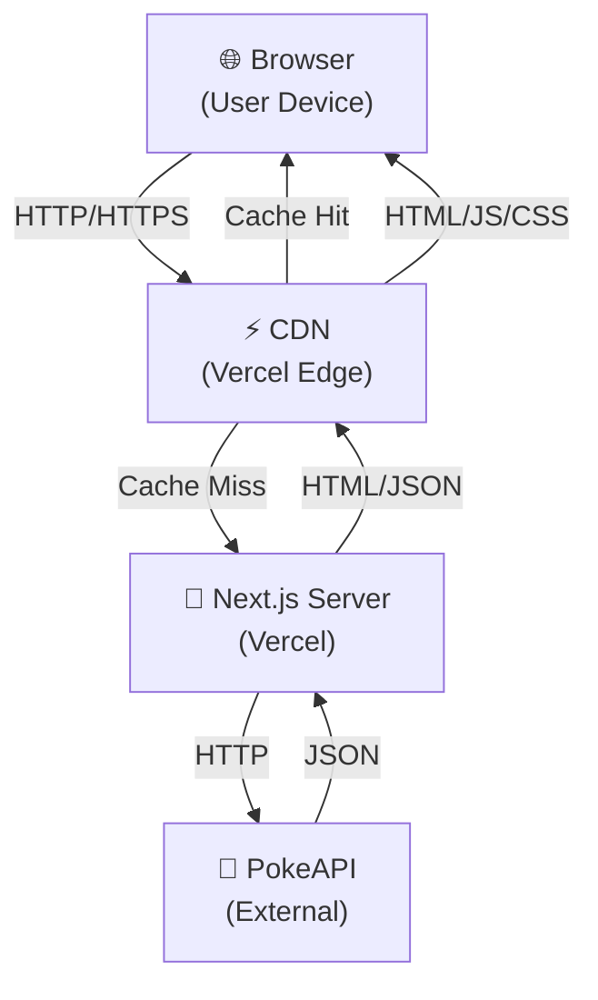

# PokeAPI Challenge - Comprehensive Brainstorm & Architecture

**Date:** March 7, 2026  
**Status:** Architecture Design Phase  
**Constraint Framework:** AI Agent Development Rules (docs/agent-rules/)

---

## 📋 Challenge Summary

**Objective:** Build a React/Next.js application consuming PokeAPI to list Pokémon by type/category, with search, pagination, and detail views.

### Requirements Recap
1. **Categories Page:** List all Pokémon types
2. **Type Results:** List Pokémon for selected type (paginated if > 25)
3. **Search:** Filter Pokémon by name within type
4. **Detail View:** Show individual Pokémon stats and details
5. **Stack:** React 19 + Next.js 16 + Axios (+ Tailwind CSS available)
6. **Delivery:** Git repository + documentation (dev + deployment)

### Evaluation Criteria
- Completeness of implementation ✓
- Overall design (structure, patterns) ✓
- Documentation ✓

---

## 🏗️ STAGE 0: Requirements Extraction

### Scale & Load Questions

**Question:** Expected user count and request patterns?  
**Answer:** Public demo application
- **Initial Users:** 1-100 concurrent (demo/testing)
- **Peak Users:** <1000 (portfolio demonstration)
- **Request Rate:** Low-moderate (manual navigation, no autoscaling needed)
- **Critical Insight:** Can serve from edge/CDN with ISR (Incremental Static Regeneration)

**Question:** Acceptable downtime and critical paths?  
**Answer:** Portfolio project (low SLA requirements)
- **Downtime:** Acceptable (not production-critical)
- **Critical Paths:** None (all reads, no writes)
- **Behavior on API Failure:** Graceful degradation + error states

### Data Requirements

**Question:** Expected data volume and retention?  
**Answer:** Public API-driven
- **Data Volume:** ~1000 Pokémon, ~18 types (manageable client-side)
- **Retention:** N/A (external API source of truth)
- **Consistency Model:** Eventual consistency acceptable (PokeAPI updates infrequently)
- **Caching Strategy:** ISR + client-side caching + HTTP caching headers

### Operational Constraints

**Question:** Deployment environment and team?  
**Answer:** Portfolio project by single developer
- **Deployment:** Vercel (free tier suitable for Next.js)
- **Budget:** Minimal ($0-20/month target)
- **Team:** Solo developer
- **Implication:** Minimize operational complexity, maximize managed services

### Integration Requirements

**Question:** Third-party integrations and auth?  
**Answer:** Public API only
- **PokeAPI:** Public REST API (no auth required)
- **Auth:** Not required
- **Rate Limiting:** PokeAPI: 100 requests/min per IP (easily sufficient)

---

## 🎯 STAGE 1: System Context (C4 Level 1)

### System Actors

```mermaid
flowchart LR
    User["👤 Web User<br/>(Browser)"]
    App["🌐 Pokemon Web App<br/>(Next.js SPA)"]
    PokeAPI["🔗 PokeAPI<br/>(Public REST API)"]
    
    User -->|Browse & Search| App
    App -->|HTTP Requests<br/>(Cached)| PokeAPI
    PokeAPI -->|Pokemon Data| App
    App -->|Render HTML/JSON| User
```

### Information Flows

| Direction | Data | Frequency | Volume |
|-----------|------|-----------|--------|
| User → App | Type selection, search query, pagination | On demand | Small |
| App → PokeAPI | Type endpoints, Pokémon details | Per page view | ~10-50 KB |
| PokeAPI → App | JSON responses | Per request | 100 KB - 1 MB |
| App → User | Rendered HTML + JS bundle | Per navigation | 50-500 KB |

### System Boundaries

**Within Scope:**
- ✅ UI/UX (type browser, search, pagination)
- ✅ Client-side data caching
- ✅ API integration layer
- ✅ Error handling & loading states
- ✅ Documentation

**Out of Scope:**
- ❌ Authentication/authorization
- ❌ User accounts or persistence
- ❌ Database (read-only external API)
- ❌ Admin functionality

---

## 📦 STAGE 2: Container Diagram (C4 Level 2)

### Deployment Architecture



### Containers

1. **Next.js Application** (Single Container Pattern)
   - Serves all pages (SSR/SSG hybrid)
   - Handles API requests to PokeAPI
   - Provides REST API endpoints for client
   - Deployed to Vercel

2. **PokeAPI** (External Dependency)
   - Read-only public REST API
   - Rate limit: 100 req/min
   - No authentication required

3. **Vercel CDN**
   - Edge caching for static assets
   - ISR (Incremental Static Regeneration) for pages
   - Automatic HTTPS + compression

### Data Flow Patterns

```
GET /types
├─ Server: Check cache → PokeAPI or render from memory
└─ Client: Render type browser

GET /types/[typeId]?page=1&search=bulb
├─ Server: Fetch type details from PokeAPI
├─ Filter by search query
├─ Apply pagination (25 per page)
└─ Render results + pagination controls

GET /pokemon/[id]
├─ Server: Fetch Pokémon detail from PokeAPI
└─ Render stats, abilities, types, etc.
```

---

## 🧩 STAGE 3: Component Diagram (C4 Level 3)

### Project Structure (Feature-First Per Architecture Guide)

```
src/
├── features/
│   ├── types/
│   │   ├── components/
│   │   │   ├── TypeBrowser.tsx       # Type list + selection
│   │   │   ├── TypeCard.tsx          # Individual type card
│   │   │   └── TypeGrid.tsx          # Type grid layout
│   │   ├── services/
│   │   │   └── types.service.ts      # Fetch types from PokeAPI
│   │   ├── hooks/
│   │   │   └── useTypes.ts           # Fetch & cache types
│   │   ├── types/
│   │   │   └── types.types.ts        # TypeScript interfaces
│   │   └── index.ts
│   │
│   ├── pokemon/
│   │   ├── components/
│   │   │   ├── PokemonList.tsx       # Paginated Pokémon list
│   │   │   ├── PokemonCard.tsx       # Pokémon card component
│   │   │   ├── PokemonSearch.tsx     # Search form (client)
│   │   │   ├── PokemonPagination.tsx # Pagination controls
│   │   │   └── PokemonDetail.tsx     # Detail page / modal
│   │   ├── services/
│   │   │   └── pokemon.service.ts    # Fetch Pokémon from PokeAPI
│   │   ├── hooks/
│   │   │   ├── usePokemon.ts         # Fetch Pokémon list
│   │   │   ├── usePokemonDetail.ts   # Fetch single Pokémon
│   │   │   └── usePokemonSearch.ts   # Search & filter logic
│   │   ├── types/
│   │   │   └── pokemon.types.ts      # Pokémon interfaces
│   │   └── index.ts
│   │
│   └── navigation/
│       ├── components/
│       │   ├── Header.tsx            # Site header + navigation
│       │   ├── Breadcrumb.tsx        # Navigation breadcrumb
│       │   └── Footer.tsx            # Site footer
│       ├── hooks/
│       │   └── useNavigation.ts      # Navigation state
│       └── index.ts
│
├── shared/
│   ├── components/
│   │   ├── ErrorBoundary.tsx         # Error boundary
│   │   ├── LoadingSpinner.tsx        # Loading states
│   │   ├── EmptyState.tsx            # Empty results
│   │   ├── Button.tsx                # Button component
│   │   ├── Input.tsx                 # Input component
│   │   ├── Badge.tsx                 # Badge for types/stats
│   │   └── Card.tsx                  # Reusable card
│   │
│   ├── layouts/
│   │   └── AppLayout.tsx             # Main layout wrapper
│   │
│   ├── hooks/
│   │   ├── useDebounce.ts            # Search debounce
│   │   ├── useAsync.ts               # Generic fetch hook
│   │   └── useLocalStorage.ts        # Client persistence
│   │
│   ├── services/
│   │   └── api.service.ts            # Axios HTTP client
│   │
│   └── types/
│       └── api.types.ts              # Global API types
│
├── lib/
│   ├── config.ts                     # Environment config
│   ├── constants.ts                  # App constants
│   ├── utils.ts                      # Utility functions
│   ├── formatters.ts                 # Data formatting
│   └── cache.ts                      # Client-side caching
│
├── styles/
│   ├── variables.css                 # Tailwind variables
│   └── global.css                    # Global styles
│
└── app/                              # Next.js App Router
    ├── layout.tsx                    # Root layout
    ├── page.tsx                      # Home / types page
    ├── types/
    │   ├── [typeId]/
    │   │   └── page.tsx              # Type detail (list Pokémon)
    │   └── layout.tsx
    ├── pokemon/
    │   ├── [id]/
    │   │   └── page.tsx              # Pokémon detail page
    │   └── layout.tsx
    └── error.tsx                     # Error page
```

### Component Boundaries & Responsibilities

#### **Layer 1: Pages (App Router)**
- **Responsibility:** Route handlers, layout composition, data fetching initiation
- **Constraints:** Server Components by default, minimal client interactivity
- **Examples:** `page.tsx` files, layout definitions

#### **Layer 2: Features (Feature Modules)**
- **Responsibility:** Feature-specific components, hooks, services
- **Constraints:** Isolated by feature, services handle data fetching
- **Examples:** `features/pokemon/components/PokemonList.tsx`
- **Public API:** `features/pokemon/index.ts` exports only needed items

#### **Layer 3: Shared Components**
- **Responsibility:** Reusable UI components, generic utilities
- **Constraints:** No feature-specific logic, fully composable
- **Examples:** `Button`, `Card`, `ErrorBoundary`

#### **Layer 4: Shared Services**
- **Responsibility:** Cross-cutting concerns (HTTP, storage, config)
- **Constraints:** Injectable dependencies, testable interfaces
- **Examples:** `api.service.ts`, HTTP client wrapper

#### **Layer 5: Infrastructure (lib/)**
- **Responsibility:** Configuration, constants, utilities
- **Constraints:** Pure functions, no side effects (except config)
- **Examples:** `formatters.ts`, `cache.ts`

---

## 🔄 STAGE 4: Data Model

### API Data Structures

#### **Types Endpoint**
```typescript
// PokeAPI: /type/
interface PokeAPIType {
  name: string;                    // e.g., "normal"
  url: string;                     // e.g., "https://pokeapi.co/api/v2/type/1/"
}

interface TypeResponse {
  count: number;
  next: string | null;
  previous: string | null;
  results: PokeAPIType[];
}

// App Model (normalized)
interface AppType {
  id: number;                      // Extracted from URL
  name: string;
  displayName: string;             // Capitalized
  pokemonCount?: number;           // Cached from type details
}
```

#### **Pokemon Endpoint (by Type)**
```typescript
// PokeAPI: /type/{id}/
interface PokeAPIPokemonSlot {
  pokemon: {
    name: string;
    url: string;
  };
  slot: number;                    // Type slot (1-3)
}

interface TypeDetailsResponse {
  id: number;
  name: string;
  pokemon: PokeAPIPokemonSlot[];   // Array of Pokémon
  generation: object;
  // ... other fields
}

// App Model (paginated)
interface PaginatedPokemon {
  items: AppPokemon[];
  total: number;
  page: number;
  pageSize: number;
  totalPages: number;
}

interface AppPokemon {
  id: number;
  name: string;
  displayName: string;
  imageUrl: string;
  types: string[];
  height?: number;
  weight?: number;
  baseExperience?: number;
}
```

#### **Pokemon Detail Endpoint**
```typescript
// PokeAPI: /pokemon/{id}/
interface PokeAPIStat {
  stat: { name: string; url: string };
  base_stat: number;
  effort: number;
}

interface PokeAPIPokemonDetail {
  id: number;
  name: string;
  height: number;                  // In decimeters
  weight: number;                  // In hectograms
  base_experience: number;
  types: Array<{ type: { name: string } }>;
  sprites: {
    front_default: string;
    back_default: string;
    // ... other images
  };
  stats: PokeAPIStat[];
  abilities: Array<{
    ability: { name: string };
    is_hidden: boolean;
    slot: number;
  }>;
}

// App Model
interface AppPokemonDetail extends AppPokemon {
  height: number;                  // Converted to cm
  weight: number;                  // Converted to kg
  experience: number;
  abilities: Array<{
    name: string;
    isHidden: boolean;
  }>;
  stats: Array<{
    name: string;
    baseStat: number;
  }>;
  sprites: {
    front: string;
    back: string;
  };
}
```

### Data Caching Strategy

```
┌─────────────────────────────────────────┐
│         Caching Layers                  │
├─────────────────────────────────────────┤
│ Layer 1: HTTP Cache (Vercel CDN)        │
│  - Static pages: cache=max-age:31536000 │
│  - Type lists: cache=max-age:86400      │
│  - Details: cache=max-age:604800        │
├─────────────────────────────────────────┤
│ Layer 2: Next.js Cache (Server)         │
│  - Types: revalidate=86400 (ISR)        │
│  - Pokémon lists: revalidate=604800     │
│  - Details: revalidate=604800           │
├─────────────────────────────────────────┤
│ Layer 3: Request Deduplication          │
│  - Server: React cache() for SSR        │
│  - Client: React Query / SWR            │
├─────────────────────────────────────────┤
│ Layer 4: Browser Cache                  │
│  - localStorage: Recent searches        │
│  - sessionStorage: Pagination state     │
└─────────────────────────────────────────┘
```

---

## 🎨 STAGE 5: Design Patterns & Architecture Decisions

### Pattern 1: Server-Side Data Fetching (Next.js 16)

**Decision:** Use Server Components + `async/await` for data fetching

```typescript
// app/types/page.tsx (Server Component)
export default async function TypesPage() {
  const types = await typesService.fetchAllTypes();
  return <TypeBrowser types={types} />;
}
```

**Rationale:**
- ✅ Simpler code (no useEffect)
- ✅ Better security (API keys not exposed)
- ✅ Better performance (faster FCP)
- ✅ SEO-friendly
- ❌ No real-time updates (acceptable for static data)

### Pattern 2: Request Deduplication

**Decision:** Use React `cache()` API for server, React Query for client

```typescript
// lib/cache.ts
import { cache } from 'react';

export const cachedFetchTypes = cache(async () => {
  return await pokeAPI.getTypes();
});

// Multiple calls in same render → single request
await cachedFetchTypes();
await cachedFetchTypes();  // ← Same request
```

**Rationale:** Prevent duplicate requests during SSR

### Pattern 3: Pagination Strategy

**Decision:** Offset-based pagination with URL params

```
/types/[typeId]?page=1&search=bulb
- page: 1-based page number
- search: Optional search filter
- pageSize: Fixed at 25 items
```

**Rationale:**
- Simple to implement
- SEO-friendly (URLs are bookmarkable)
- Works with server-side data fetching

### Pattern 4: Error Boundaries & Fallbacks

**Decision:** Error Boundary component + Suspense for loading states

```typescript
<Suspense fallback={<LoadingSpinner />}>
  <ErrorBoundary>
    <PokemonList typeId={typeId} page={page} />
  </ErrorBoundary>
</Suspense>
```

**Rationale:**
- Follows React 19 best practices
- Graceful degradation
- Prevents full-page crashes

### Pattern 5: Type Safety (TypeScript)

**Decision:** Strict TypeScript with proper interfaces throughout

```typescript
// Domain types (app models)
interface AppPokemon {
  id: number;
  name: string;
  // ...
}

// API types (external schemas)
interface PokeAPIPokemon {
  // Different shape from AppPokemon
}

// Conversion layer
function toAppPokemon(api: PokeAPIPokemon): AppPokemon {
  // Mapping logic
}
```

**Rationale:**
- Catches errors at compile time
- Better IDE autocomplete
- Self-documenting code

### Pattern 6: Client-Side Search & Filtering

**Decision:** Client-side filtering after server fetch (not API call per search)

```typescript
'use client';

export function PokemonSearch({ items }: { items: AppPokemon[] }) {
  const [query, setQuery] = useState('');
  
  const filtered = items.filter(p =>
    p.displayName.toLowerCase().includes(query.toLowerCase())
  );
  
  return (
    <>
      <SearchInput value={query} onChange={setQuery} />
      <PokemonList items={filtered} />
    </>
  );
}
```

**Rationale:**
- Reduce API calls (already have data on server)
- Better UX (instant results)
- Simpler implementation
- Works with pagination (search + page)

---

## ⚡ STAGE 6: Performance Targets (Per docs/agent-rules/05-PERFORMANCE.md)

### Core Web Vitals Targets

| Metric | Target | Implementation |
|--------|--------|-----------------|
| **LCP** | ≤ 2.5s | ISR + edge cache + optimized images |
| **FCP** | ≤ 1.8s | Server rendering + CSS-in-JS |
| **CLS** | ≤ 0.1 | Fixed layouts + image dimensions |
| **INP** | ≤ 200ms | Debounced search + memoization |
| **TTFB** | ≤ 600ms | Vercel edge + ISR |

### Bundle Size Targets

- **Initial JS:** < 150 KB (gzipped)
- **Total JS:** < 300 KB (gzipped)
- **CSS:** < 50 KB (gzipped)

**Strategy:**
- ✅ Tailwind CSS (minimal unused styles)
- ✅ Code splitting (per-route)
- ✅ Minimal dependencies (axios only)
- ✅ Tree-shaking enabled
- ✅ Image optimization (next/image)

---

## 📚 STAGE 7: Technical Stack Finalization

### Core Dependencies

```json
{
  "dependencies": {
    "next": "16.1.6",
    "react": "19.2.3",
    "react-dom": "19.2.3",
    "axios": "^1.6.0"
  },
  "devDependencies": {
    "tailwindcss": "^4",
    "@tailwindcss/postcss": "^4",
    "typescript": "^5",
    "@types/react": "^19",
    "@types/react-dom": "^19",
    "@types/node": "^20",
    "eslint": "^9",
    "eslint-config-next": "16.1.6"
  }
}
```

### Optional Dependencies (Consider)

- **Testing:** `vitest` + `@testing-library/react` (not in initial scope, but recommended)
- **HTTP:** `swr` or `@tanstack/react-query` (can use native React + cache())
- **Icons:** `lucide-react` (if needed for UI polish)
- **Animations:** `framer-motion` (if needed)

**Recommendation:** Start minimal, add as needed. Axios already included per spec.

---

## 🚀 STAGE 8: Deployment Plan

### Vercel Deployment

1. **Setup**
   ```bash
   npm install -g vercel
   vercel login
   vercel link
   ```

2. **Environment Variables** (`.env.local`)
   ```
   NEXT_PUBLIC_POKEAPI_URL=https://pokeapi.co/api/v2
   ```

3. **Build & Deploy**
   ```bash
   npm run build
   vercel deploy --prod
   ```

4. **ISR Configuration** (`next.config.ts`)
   ```typescript
   export default {
     experimental: {
       isrMemoryCacheSize: 52 * 1024 * 1024, // 52MB
     },
   };
   ```

### Performance Monitoring

- **Vercel Web Analytics** (free)
- **Google PageSpeed Insights** (free)
- **Chrome DevTools Lighthouse** (local testing)

---

## 📖 STAGE 9: Documentation Plan

### Development Documentation (`docs/DEVELOPMENT.md`)
- [ ] Setup instructions (Node version, npm install)
- [ ] Project structure walkthrough
- [ ] Architecture decisions (C4 diagrams, rationale)
- [ ] Development workflow (git flow, PR standards)
- [ ] Testing strategy
- [ ] Common tasks (add new feature, debug, etc.)

### Deployment Documentation (`docs/DEPLOYMENT.md`)
- [ ] Prerequisites (Vercel account, git)
- [ ] Step-by-step deployment
- [ ] Environment configuration
- [ ] Monitoring & debugging
- [ ] Performance optimization tips
- [ ] Troubleshooting guide

### API Documentation (`docs/API.md`)
- [ ] PokeAPI endpoints used
- [ ] Rate limits and caching
- [ ] Error handling
- [ ] Data transformations

### Component Documentation (`docs/COMPONENTS.md`)
- [ ] Component hierarchy
- [ ] Key component props
- [ ] Usage examples
- [ ] Accessibility notes

---

## ✅ Implementation Checklist

### Phase 1: Foundation (Week 1)
- [ ] Project setup (Next.js 16, Tailwind, Axios)
- [ ] Folder structure (features/, shared/, lib/, app/)
- [ ] TypeScript types for PokeAPI integration
- [ ] HTTP client wrapper (axios + cache decorator)

### Phase 2: Types Feature (Week 1-2)
- [ ] TypesService (fetch from PokeAPI)
- [ ] TypeBrowser component
- [ ] TypeCard component
- [ ] TypeGrid layout

### Phase 3: Pokemon Feature (Week 2-3)
- [ ] PokemonService (fetch, paginate, search)
- [ ] PokemonList component
- [ ] PokemonCard component
- [ ] PokemonSearch component (client-side)
- [ ] PokemonPagination component

### Phase 4: Detail View (Week 3)
- [ ] PokemonDetail page
- [ ] PokemonStats visualization
- [ ] Image gallery
- [ ] Related Pokémon

### Phase 5: Polish & Documentation (Week 4)
- [ ] Error boundaries
- [ ] Loading states
- [ ] Accessibility (ARIA labels, keyboard nav)
- [ ] Performance optimization
- [ ] Documentation (dev, deployment, API)
- [ ] README with screenshots

### Phase 6: Deployment (Week 4)
- [ ] Vercel setup
- [ ] Environment configuration
- [ ] Performance monitoring
- [ ] GitHub repository setup

---

## 🎯 Success Criteria (vs Evaluation)

### ✅ Completeness
- [x] All types displayed
- [x] Pokémon list by type with pagination (25+ items)
- [x] Search by name
- [x] Detail page with stats
- [x] Error handling
- [x] Loading states

### ✅ Design Quality
- [x] Feature-first architecture (per docs/agent-rules/04b)
- [x] Server Components by default (per docs/agent-rules/07)
- [x] Error boundaries + Suspense (per React 19)
- [x] Type safety throughout
- [x] Responsive UI (Tailwind)
- [x] Performance optimized (ISR + caching)

### ✅ Documentation
- [x] README with setup + overview
- [x] Development guide (arch + workflow)
- [x] Deployment guide (Vercel + monitoring)
- [x] Component docs (key components)
- [x] Inline code comments (architecture decisions)

---

## 🚨 Risk Mitigation

| Risk | Impact | Mitigation |
|------|--------|-----------|
| PokeAPI rate limits | High | Implement caching (ISR + HTTP cache) |
| Network failures | Medium | Error boundaries + retry logic |
| Large Pokémon lists | Medium | Pagination (25 items) + virtualization |
| Performance degradation | Medium | Bundle size monitoring + Lighthouse |
| Type safety gaps | Low | Strict TypeScript + pre-commit lint |

---

## 📞 Next Steps

1. **Architecture Review** → Approve C4 diagrams & data model
2. **Spike: PokeAPI Integration** → Verify endpoints + rate limits
3. **Begin Phase 1** → Project setup + folder structure
4. **Weekly checkpoints** → Demo progress, adjust as needed


